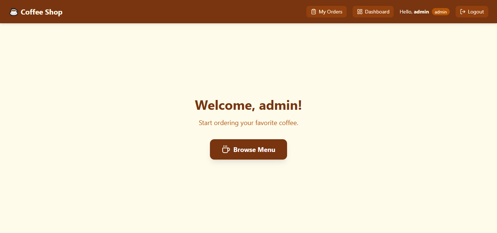
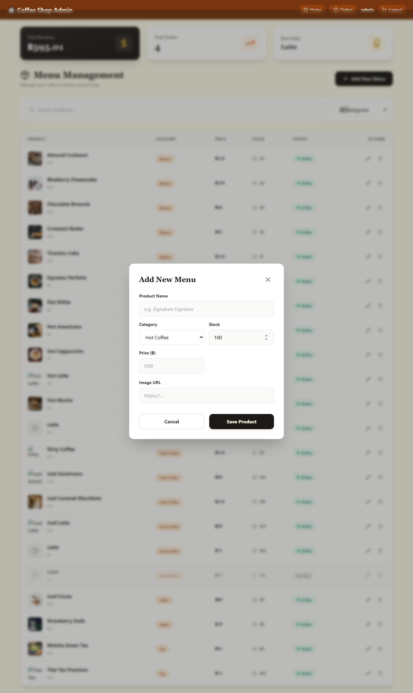
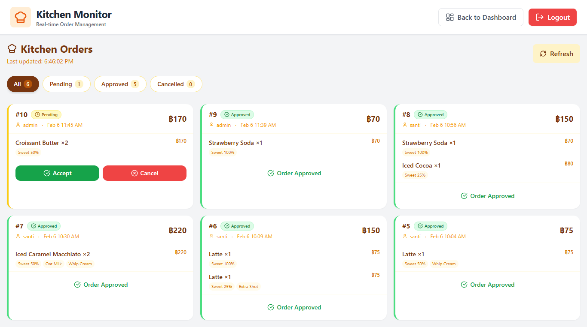
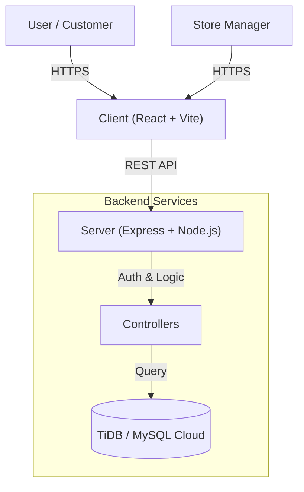
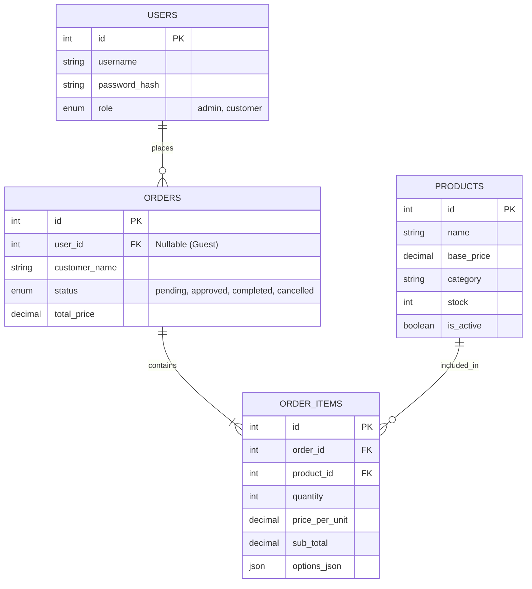

# ☕ Coffee Shop Ordering System


A modern, full-stack coffee ordering application built with **React (Vite)** and **Node.js (Express)**, featuring a responsive mobile-first design, real-time-ready architecture, and a robust admin dashboard.

---

## ✨ Key Features

### 📱 Customer Experience
- **Mobile-First Design**: Optimized for all devices with a custom bottom navigation bar on mobile.
- **Dynamic Menu**: Browse 60+ items across categories (Coffee, Tea, Bakery, Food, etc.).
- **Smart Cart**: Add items, adjust quantities, and calculate totals instantly.
- **Flexible Ordering**: Support for both **Guest Checkout** and **Member Login**.
- **Order Tracking**: View order status (Pending → Approved → Completed).

### 🛡️ Admin Dashboard
- **Dashboard Overview**: Real-time visualization of Total Revenue, Total Orders, and Best Sellers.
- **Order Management**: View all orders, filter by status, and update statuses (Pending/Approved/Completed/Cancelled).
- **Product Management**: View product details and stock levels (Database ready).
- **Security**: Protected routes, JWT Authentication, and Role-Based Access Control (RBAC).

### 📸 Screenshots
<div align="center">
  
  
  <br/>
  
  
</div>

---

### 🔧 Technical Highlights
- **Security First**: Rate limiting on auth routes, secure header management, and rigorous input validation.
- **Scalable Database**: Powered by **TiDB (MySQL compatible)**, fully normalized schema with Foreign Key constraints.
- **Performance**: Optimized frontend builds with Vite, backend connection pooling.
- **Type Safety**: Full **TypeScript** support across Client and Server.

---

## 🏗️ Architecture

### System Overview




### Database Schema




---

## 🚀 Getting Started

### Prerequisites
- **Node.js** (v18 or higher)
- **TiDB Cluster** (or local MySQL 8.0+)
- **Git**

### 1. Clone the Repository
```bash
git clone https://github.com/your-username/coffee-ordering-system.git
cd coffee-ordering-system
```

### 2. Backend Setup
```bash
cd server
npm install
```

Create a `.env` file in the `server` directory:
```env
PORT=3000
DB_HOST=your-tidb-host.tidbcloud.com
DB_PORT=4000
DB_USER=your-db-user.root
DB_PASSWORD=your-db-password
DB_NAME=coffee_db
JWT_SECRET=your_super_secret_jwt_key
CORS_ORIGINS=http://localhost:5173
```

Seed the database (Optional - requires DB connection):
```bash
npx ts-node src/seed.ts
```

Start the server:
```bash
npm run dev
```

### 3. Frontend Setup
Open a new terminal:
```bash
cd client
npm install
```

Create a `.env` file in the `client` directory:
```env
VITE_API_URL=http://localhost:3000
```

Start the client:
```bash
npm run dev
```

Visit `http://localhost:5173` to view the app!

---

## 📂 Project Structure

```
coffee-ordering-system/
├── client/                 # React Frontend
│   ├── src/
│   │   ├── api/           # Axios setup
│   │   ├── components/    # Reusable UI components
│   │   ├── content/       # Static content/context
│   │   ├── pages/         # Route pages (Menu, Cart, Admin)
│   │   └── types/         # TypeScript interfaces
│   └── ...
├── server/                 # Express Backend
│   ├── src/
│   │   ├── config/        # DB connection
│   │   ├── controllers/   # Business logic
│   │   ├── middleware/    # Auth & Rate limiters
│   │   ├── routes/        # API endpoints
│   │   └── seed.ts        # Database seeding script
│   └── database/          # SQL init scripts
└── ...
```

---

## 🤝 Contributing

1. Fork the project
2. Create your feature branch (`git checkout -b feature/AmazingFeature`)
3. Commit your changes (`git commit -m 'Add some AmazingFeature'`)
4. Push to the branch (`git push origin feature/AmazingFeature`)
5. Open a Pull Request

---

## 📄 License

Distributed under the MIT License. See `LICENSE` for more information.
