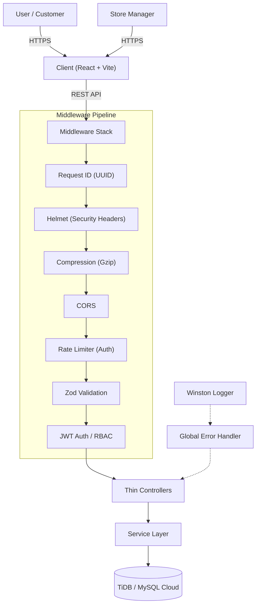
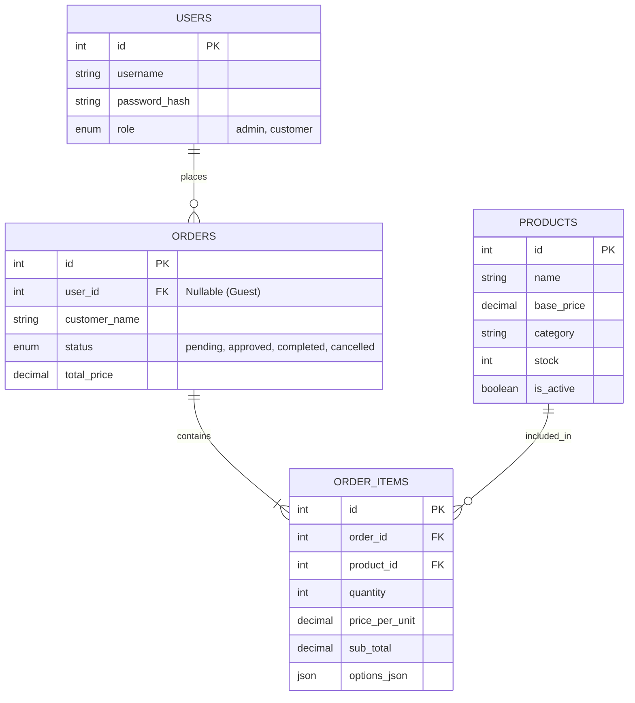

# ☕ Coffee Shop Ordering System


An **enterprise-grade**, full-stack coffee ordering application built with **React (Vite)** and **Node.js (Express)**, featuring a layered architecture, structured logging, input validation, and a robust admin dashboard.

---

## ✨ Key Features

### 📱 Customer Experience
- **Mobile-First Design**: Optimized for all devices with a custom bottom navigation bar on mobile.
- **Dynamic Menu**: Browse 60+ items across categories (Coffee, Tea, Bakery, Food, etc.).
- **Smart Cart**: Add items, adjust quantities, and calculate totals instantly.
- **Flexible Ordering**: Support for both **Guest Checkout** and **Member Login**.
- **Order Tracking**: View order status (Pending → Approved → Completed).

### 🛡️ Admin Dashboard
- **Dashboard Overview**: Real-time visualization of Total Revenue, Total Orders, and Best Sellers.
- **Order Management**: View all orders, filter by status, and update statuses (Pending/Approved/Completed/Cancelled).
- **Product Management**: View product details and stock levels (Database ready).
- **Security**: Protected routes, JWT Authentication, and Role-Based Access Control (RBAC).

### 📸 Screenshots
<div align="center">
  
  
  <br/>
  
  
</div>

---

## 🏢 Enterprise Architecture

### Design Principles

| Principle | Implementation |
|-----------|---------------|
| **Separation of Concerns** | Routes → Controllers → Services → Database |
| **Fail Fast** | Zod schema validation on all mutating endpoints |
| **Observability** | Winston structured logging + Request ID correlation |
| **Security in Depth** | Helmet, rate limiting, JWT RBAC, CORS, input validation |
| **Standardized Responses** | Consistent `{ success, data, message, meta? }` envelope |
| **Graceful Degradation** | React Error Boundary, global error handler, graceful shutdown |

### System Overview



### Layered Architecture

```
Request Flow:
┌──────────────┐     ┌──────────────┐     ┌──────────────┐     ┌──────────────┐
│   Route +    │────▶│    Thin      │────▶│   Service    │────▶│   Database   │
│  Validation  │     │  Controller  │     │    Layer     │     │    (MySQL)   │
└──────────────┘     └──────────────┘     └──────────────┘     └──────────────┘
       │                    │                    │
   Zod Schema          asyncHandler          Business Logic
   Middleware          + apiResponse         + AppError throws
```

### Database Schema



---

## 🔧 Technical Highlights

### Backend (Enterprise Patterns)
- **Service Layer**: Business logic separated from HTTP concerns for testability.
- **Input Validation**: Zod schemas on all POST/PUT endpoints with structured error messages.
- **Structured Logging**: Winston with JSON format (production) / pretty print (development).
- **Global Error Handler**: Custom `AppError` hierarchy (NotFound, Validation, Unauthorized, Forbidden, Conflict, TooManyRequests).
- **asyncHandler**: Eliminates try-catch boilerplate — errors auto-forward to error handler.
- **Standardized API Responses**: `sendSuccess()`, `sendCreated()`, `sendPaginated()` helpers.
- **Request ID Tracking**: UUID `X-Request-Id` header on every request for debugging.
- **Pagination**: `page` & `limit` query params on list endpoints with meta in response.
- **Security**: Helmet headers, gzip compression, rate limiting, SSL-ready.
- **Graceful Shutdown**: Handles SIGTERM/SIGINT with connection draining.

### Frontend (Production Quality)
- **React Error Boundary**: Catches runtime errors with user-friendly fallback UI.
- **Custom Hooks**: `useProducts()` and `useOrders()` with loading/error state management.
- **Axios Interceptors**: Auto-logout on 401, request timeout (15s), token injection.
- **Type Safety**: Full TypeScript coverage across client and server.
- **Performance**: Optimized builds with Vite, `useCallback`/`useMemo` where needed.

### Infrastructure
- **Docker**: Multi-stage Dockerfile (build → production alpine image).
- **Docker Compose**: MySQL + Server services with health checks and dependency ordering.
- **Testing**: Vitest on both client (4 tests) and server (17 tests).

---

## 🚀 Getting Started

### Prerequisites
- **Node.js** (v18 or higher)
- **TiDB Cluster** (or local MySQL 8.0+)
- **Git**
- **Docker** (optional, for containerized setup)

### Option 1: Docker Compose (Recommended)
```bash
git clone https://github.com/your-username/coffee-ordering-system.git
cd coffee-ordering-system

# Set JWT secret
export JWT_SECRET=your_super_secret_key

# Start MySQL + Server
docker compose up -d

# Start Frontend
cd client && npm install && npm run dev
```

### Option 2: Manual Setup

#### Backend
```bash
cd server
npm install
cp .env.example .env  # then edit with your DB credentials
npm run dev
```

#### Frontend
```bash
cd client
npm install
cp .env.example .env  # set VITE_API_URL
npm run dev
```

Visit `http://localhost:5173` to view the app!

### Environment Variables

#### Server (`server/.env`)
```env
PORT=3000
NODE_ENV=development
DB_HOST=localhost
DB_PORT=3306
DB_USER=root
DB_PASSWORD=rootpassword
DB_NAME=coffee_db
JWT_SECRET=your_super_secret_jwt_key
CORS_ORIGINS=http://localhost:5173
LOG_LEVEL=info
```

#### Client (`client/.env`)
```env
VITE_API_URL=http://localhost:3000
```

---

## 🧪 Testing

```bash
# Server tests (17 tests — AppError, Pagination)
cd server && npm test

# Client tests (4 tests — calcItemTotal)
cd client && npx vitest run

# TypeScript type checking
cd server && npx tsc --noEmit
cd client && npx tsc -b
```

---

## 📂 Project Structure

```
coffee-ordering-system/
├── client/                     # React Frontend (Vite)
│   ├── src/
│   │   ├── api/               # Axios instance + interceptors
│   │   ├── components/        # ErrorBoundary, UI components
│   │   ├── context/           # AuthContext, CartContext
│   │   ├── hooks/             # useProducts, useOrders
│   │   ├── pages/             # Route pages (Menu, Cart, Admin)
│   │   └── types/             # TypeScript interfaces
│   └── ...
├── server/                     # Express Backend
│   ├── src/
│   │   ├── config/            # DB connection, Winston logger
│   │   ├── controllers/       # Thin HTTP controllers
│   │   ├── middleware/        # Auth, validation, errorHandler, requestId
│   │   ├── routes/            # API endpoints + Zod validation
│   │   ├── services/          # Business logic layer
│   │   ├── utils/             # AppError, asyncHandler, apiResponse, pagination
│   │   ├── validators/        # Zod schemas (auth, order, product)
│   │   └── seed.ts            # Database seeding script
│   ├── database/              # SQL init scripts
│   ├── Dockerfile             # Multi-stage production build
│   └── vitest.config.ts       # Server test configuration
├── docker-compose.yml          # MySQL + Server orchestration
└── ...
```

---

## 📡 API Reference

### Response Format
All endpoints return a consistent envelope:
```json
{
  "success": true,
  "message": "Success",
  "data": { ... },
  "meta": { "page": 1, "limit": 20, "total": 95, "totalPages": 5 }
}
```

### Endpoints
| Method | Path | Auth | Description |
|--------|------|------|-------------|
| `POST` | `/api/auth/register` | — | Register (Zod validated) |
| `POST` | `/api/auth/login` | — | Login (rate limited) |
| `GET` | `/api/auth/profile` | JWT | Get user profile |
| `GET` | `/api/products` | — | List products (paginated) |
| `GET` | `/api/products/:id` | — | Get product by ID |
| `POST` | `/api/products` | Admin | Create product (Zod validated) |
| `PUT` | `/api/products/:id` | Admin | Update product (Zod validated) |
| `DELETE` | `/api/products/:id` | Admin | Soft/hard delete product |
| `POST` | `/api/orders` | Optional | Create order (Zod validated) |
| `GET` | `/api/orders/my-orders` | JWT | Get user's orders |
| `GET` | `/api/orders` | Admin | List all orders (paginated) |
| `PUT` | `/api/orders/:id/status` | Admin | Update order status |
| `GET` | `/api/stats` | Admin | Dashboard statistics |
| `GET` | `/api/health` | — | Health check + uptime |

---

## 🤝 Contributing

1. Fork the project
2. Create your feature branch (`git checkout -b feature/AmazingFeature`)
3. Commit your changes (`git commit -m 'Add some AmazingFeature'`)
4. Push to the branch (`git push origin feature/AmazingFeature`)
5. Open a Pull Request

---

## 📄 License

Distributed under the MIT License. See `LICENSE` for more information.
