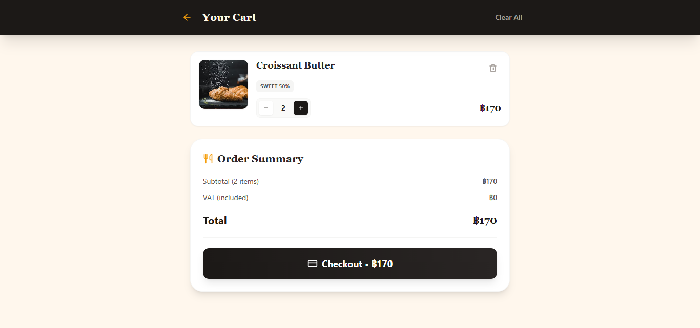
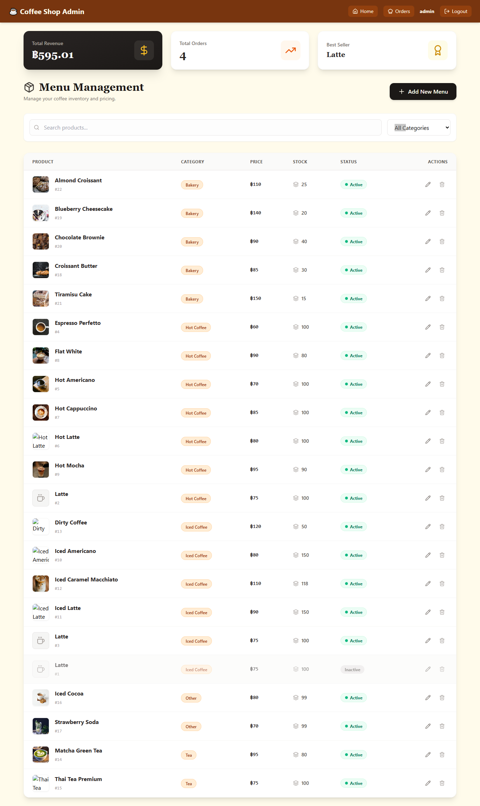

# Coffee Shop Ordering System

A full-stack coffee shop ordering system built with **React + TypeScript** (Frontend) and **Node.js + Express + TypeScript** (Backend), backed by **MySQL 8.0**.


## Tech Stack

### Backend (`server/`)

- Node.js + Express + TypeScript
- MySQL 8.0 (via mysql2)
- Socket.IO (real-time order updates)
- JWT Authentication
- Multer (file uploads)

### Frontend (`client/`)

- Vite + React + TypeScript
- Tailwind CSS
- React Router DOM
- Axios
- Socket.IO Client
- Lucide React (icons)

## Prerequisites

- [Node.js](https://nodejs.org/) v18+
- [Docker](https://www.docker.com/) & Docker Compose

## Getting Started

### 1. Start the Database

```bash
docker-compose up -d
```

### 2. Install & Start the Backend

```bash
cd server
npm install
npm run dev
```

The API server will run on **http://localhost:3000**.

### 3. Install & Start the Frontend

```bash
cd client
npm install
npm run dev
```

The frontend will run on **http://localhost:5173**.

## Screenshots

### Customer View




### Admin View




## Project Structure

```
coffee-ordering-system/
├── docker-compose.yml
├── README.md
├── server/
│   ├── package.json
│   ├── tsconfig.json
│   ├── .env
│   ├── database/
│   │   └── init.sql
│   └── src/
│       ├── app.ts
│       ├── seed.ts
│       └── config/
│           └── database.ts
│       └── controllers/
│           └── authController.ts
│           └── order.Controller.ts
│           └── product.Controller.ts
│           └── stats.Controller.ts
│       └── middlewares/
│           └── auth.ts
│       └── routes/
│           └── auth.ts
│           └── order.Routes.ts
│           └── product.Routes.ts
│           └── stats.Routes.ts
│       └── types/
│           └── index.ts
└── client/
    ├── package.json
    ├── tsconfig.json
    ├── vite.config.ts
    ├── tailwind.config.js
    ├── postcss.config.js
    ├── index.html
    └── src/
        ├── main.tsx
        ├── index.css
        ├── App.tsx
        ├── vite-env.d.ts
        └── api/
           └── axios.ts
        └── components/
            └── ProductModal.tsx
        └── contexts/
            └── AuthContext.tsx
            └── CartContext.tsx
        └── pages/
            └── AdminDashboard.tsx
            └── AdminOrders.tsx
            └── AdminOrderLayout.tsx
            └── Cart.tsx
            └── LoginPage.tsx
            └── Menu.tsx
            └── OrderHistory.tsx
            └── RegisterPage.tsx
        └── types/
            └── index.ts


```

## Database Tables

- **users** — Admin and customer accounts
- **products** — Coffee menu items
- **orders** — Customer orders with payment slip
- **order_items** — Individual items in each order
